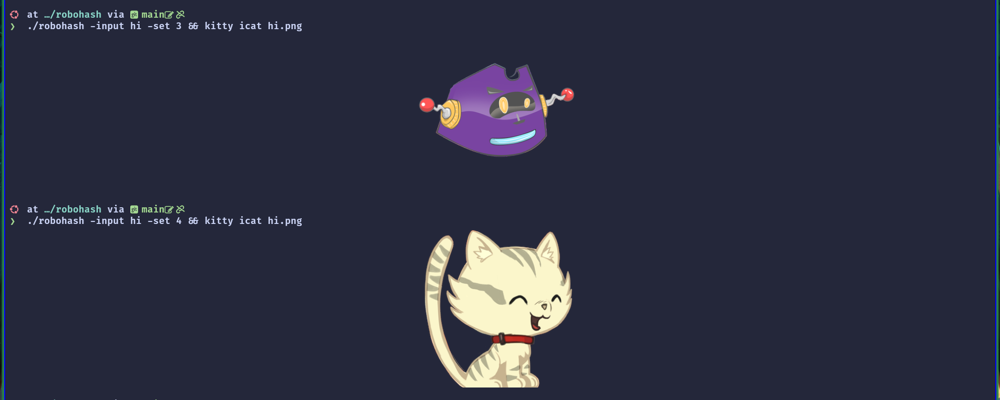
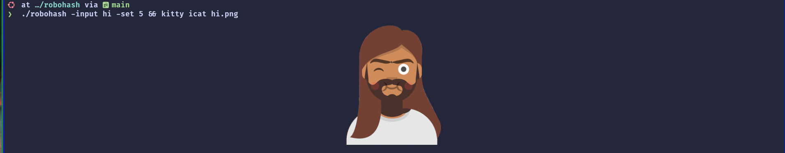

<div align="center">

# 🤖 RoboHash

### Generate unique robot avatars from any text


<p>
  <a href="https://choosealicense.com/licenses/mit/">
    
  </a>
  
  
</p>

A Go port of [Robohash](https://github.com/e1ven/Robohash) — turn any string into a unique, deterministic robot avatar.

[Installation](#-installation) • [Usage](#-usage) • [Examples](#-examples) • [Attribution](#-attribution)

</div>

---

## ✨ Features

- 🎨 **5 Different Sets**: Robots, monsters, cats, and human avatars
- 🎭 **10 Color Schemes**: For Set 1 robots
- 📦 **Multiple Formats**: PNG, JPG, GIF, WebP, and Data URI
- 🎯 **Deterministic**: Same input always produces the same avatar
- ⚡ **Fast**: Built with Go for maximum performance
- 🖼️ **Custom Backgrounds**: Optional background layers

---

## 📦 Installation

### Quick Install
```bash
# Clone the repository
git clone https://github.com/fl4vis/robohash.git
cd robohash

# Build and extract
make all
cd build
tar -xvzf robohash.tar.gz
```

### Or Download Release
Download the latest release from [GitHub Releases](https://github.com/fl4vis/robohash/releases)

---

## 🚀 Usage

### Basic Example
```bash
./robohash -input "hello@example.com"
```

### Advanced Example
```bash
./robohash -input "user@example.com" -set 1 -color blue -bgset 1 -sizex 500 -sizey 500 -extension webp
```

---

## ⚙️ Configuration

### 🎨 Appearance Options

| Flag | Default | Description |
|------|---------|-------------|
| `-set`   | `any` | Avatar style:<br/>• `1` - Robots (original)<br/>• `2` - Monsters<br/>• `3` - Robots (alt)<br/>• `4` - Cats<br/>• `5` - Humans<br/>• `any` - Random |
| `-color` | - | **Set 1 only**:<br/>`blue`, `brown`, `green`, `grey`, `orange`, `pink`, `purple`, `red`, `white`, `yellow` |
| `-bgset` | - | Background:<br/>• `1` - Background set 1<br/>• `2` - Background set 2<br/>• `any` - Random |

### 📐 Output Options

| Flag | Default | Description |
|------|---------|-------------|
| `-extension` |  `png` | Format: `png`, `jpg`, `jpeg`, `gif`, `webp`, `ppm`, `datauri` |
| `-sizex` | `300` | Width in pixels |
| `-sizey` | `300` | Height in pixels |

### 🔧 Input Options

| Flag | Default | Description |
|------|---------|-------------|
| `-input` | **required** | String to hash into avatar |
| `-ignoreExt` | `true` | Ignore file extensions when hashing |
| `-slots` | `11` | Hash slot divisions ⚠️ *Advanced option* |

---

## 🎨 Examples

<div align="center">





</div>

---

## 📖 How It Works

RoboHash generates avatars deterministically:
1. Your input string is hashed using SHA-256
2. The hash is split into segments (slots)
3. Each slot determines a specific image layer
4. Layers are composited together to create the final avatar

**Same input = Same avatar, always!** Perfect for user avatars, identicons, or fun profile pictures.

---

<div align="center">

**Support this project:**

<a href="https://paypal.me/flavflamenco?locale.x=en_US&country.x=EC" target="_blank">
  
</a>

</div>

---

## 🙏 Attribution

This project uses artwork from [Robohash.org](https://robohash.org):

- **Set 1**: Robots by Zikri Kader
- **Set 2**: Monsters by Hrvoje Novakovic  
- **Set 3**: Robots by Julian Peter Arias
- **Set 4**: Cats by David Revoy
- **Set 5**: Humans by Pablo Stanley

All images are licensed under [CC-BY 4.0](https://creativecommons.org/licenses/by/4.0/)

---

## 📝 License

This project is licensed under the [MIT License](LICENSE)

---

<div align="center">

**Made with ❤️ and Go**

⭐ Star this repo if you find it useful!

</div>
